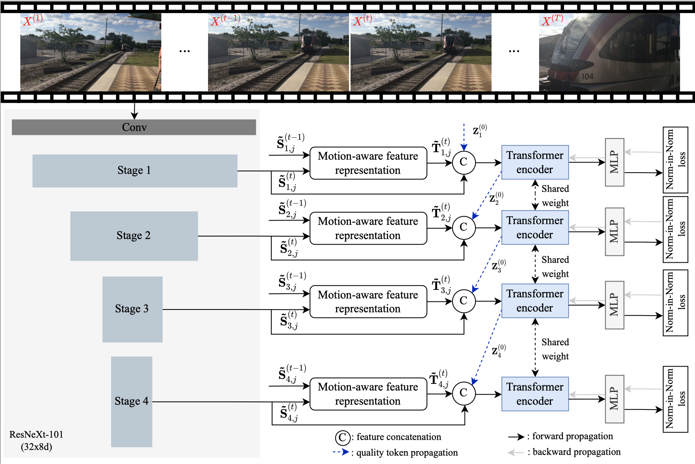

# STI-VQA
This repository contains the offical implementations along with the experimental splits for the paper "[Learning Spatiotemporal Interactions for User-Generated Video Quality Assessment](https://ieeexplore.ieee.org/document/9896907)", in *IEEE Transactions on Circuits and Systems for Video Technology*, vol. 33, no. 3, pp. 1031-1042, Mar. 2023.
 Hanwei Zhu, Baoliang Chen, Lingyu Zhu, and [Shiqi Wang](https://www.cs.cityu.edu.hk/~shiqwang/).


## Framework


### Prerequisites
The release codes were implemented and have been tested in Ubuntu 18.04 with
- Python = 3.6.13
- PyTorch = 1.8.1
- torchvision = 0.9.0 

## Feature extraction
More details can be found in README.md in the folder of `extract_features`.

## Training on VQA Databases
You can change the paramers in `param.py` to train each dataset with intra-/cross-dataset settings:
```bash
python main.py --test_only False
```

## Testing on VQA Databases
You can change the paramers in `param.py` to train and test each dataset, and the trained parameters of the proposed model on each dataset can be found at [Google Drive](https://drive.google.com/drive/folders/16p2-vY3Fry5r4PK4b1ZBrioBtq0jOObu?usp=sharing): 
```bash
python main.py --test_only True
```


## Acknowledgement
The authors would like to thank Dingquan Li for his implementation of [VSFA](https://github.com/lidq92/VSFA), [Yang Li](https://github.com/sherlockyy) for his code architecture, the [BVQA_Benchmark](https://github.com/vztu/BVQA_Benchmark), and the implementation of [ViT](https://github.com/lucidrains/vit-pytorch).

## Citation
```bibtex
@article{zhu2022learing,
title={Learning Spatiotemporal Interactions for User-Generated Video Quality Assessment},
author={Zhu, Hanwei and Chen, Baoliang and Zhu, lingyu and Wang, Shiqi},
journal={IEEE Transactions on Circuits and Systems for Video Technology},
volume={33},
number={3},
pages={1031-1042},
month={Mar.},
year={2023}
}
